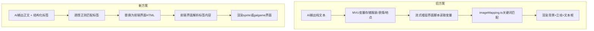
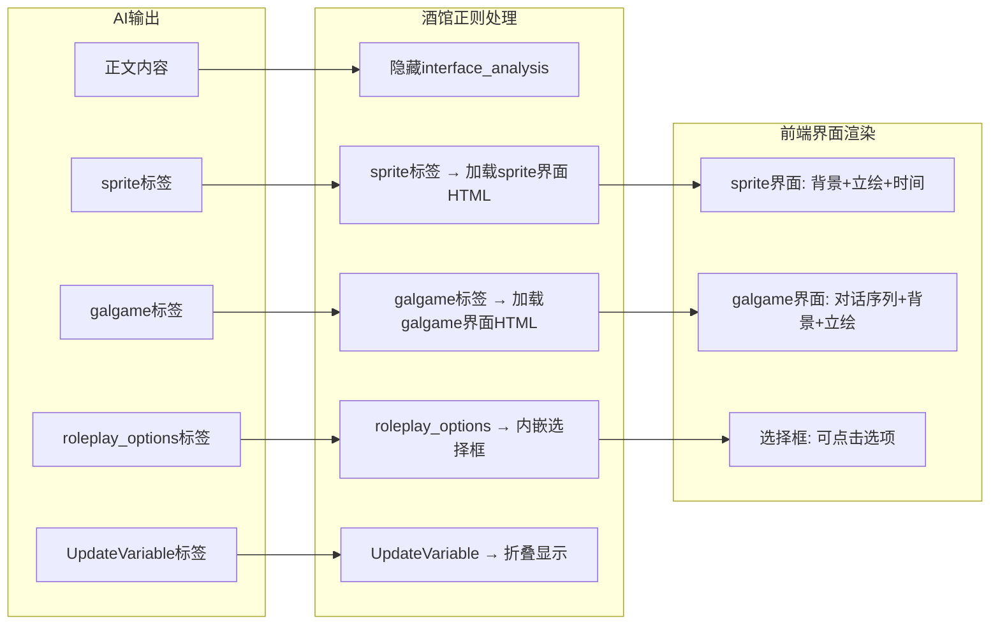

# Galgame界面与立绘系统重做计划

## 概述

推翻现有的流式楼层界面方案（`脚本/galgame界面/`），改为参照 galgame角色卡示例（络络）的方式：
- AI在回复中输出结构化标签（`<sprite>`、`<galgame>`）
- 酒馆正则匹配标签并替换为前端界面HTML
- 前端界面通过webpack打包后部署到CDN

## 架构对比



## 需要删除的文件

- `src/佩伊洛/脚本/galgame界面/` — 整个文件夹（旧的流式楼层galgame界面）
- `src/佩伊洛/界面/状态栏/` — 整个文件夹（不再需要状态栏）
- `src/佩伊洛/imageMapping.ts` — 旧的图片映射逻辑

## 需要新建的文件

### 1. 前端界面：sprite界面

位置：`src/佩伊洛/界面/sprite界面/`

功能：显示正文内容 + 底部立绘叠加在背景上

文件结构：
- `index.html` — 空body
- `index.ts` — 入口，挂载Vue
- `App.vue` — 主组件，解析sprite标签数据，渲染背景+立绘+时间信息

AI输出格式（参照络络示例）：
```
<sprite>
立绘: ${服装}/${表情}.png
场景: ${地点}/${地点情况}.jpg
时间: ${主观时间名称}
</sprite>
```

### 2. 前端界面：galgame界面

位置：`src/佩伊洛/界面/galgame界面/`

功能：渲染Chat[]对话序列，类似视觉小说的对话推进界面

文件结构：
- `index.html` — 空body
- `index.ts` — 入口，挂载Vue
- `App.vue` — 主组件，解析galgame标签中的YAML Chat[]数据
- `components/DialogueBox.vue` — 对话框组件（显示speaker+speech）
- `components/ChoicePanel.vue` — 选择框组件（解析roleplay_options）

AI输出格式（参照络络示例）：
```
<galgame>
```yaml
- speaker: 佩伊洛
  speech: 台词内容
  background: 地点/时间.jpg
  tachie: 服装/表情.png
- speaker: 旁白
  speech: 旁白内容
  background: 地点/时间.jpg
```
</galgame>
```

### 3. 前端界面：欢迎页（重做）

位置：`src/佩伊洛/界面/欢迎页/`（覆盖现有）

功能：角色介绍 + 开始按钮

### 4. 正则规则

位置：在 `src/佩伊洛/index.yaml` 中配置正则条目

需要的正则：
- **[界面]sprite** — 匹配 `<sprite>...</sprite>` 标签，替换为加载sprite界面的HTML
- **[界面]galgame** — 匹配 `<galgame>...</galgame>` 标签，替换为加载galgame界面的HTML
- **[内嵌]选择框** — 匹配 `<roleplay_options>...</roleplay_options>` 标签
- **[折叠]变量更新中** — 匹配流式中的UpdateVariable标签
- **[折叠]完整变量更新** — 匹配完成后的UpdateVariable标签
- **[隐藏]interface_analysis** — 隐藏AI的界面分析思考过程

### 5. 世界书条目（新建/修改）

#### 新建：
- `世界书/文件-立绘[mvu_plot].yaml` — 立绘文件列表（服装+表情枚举）
- `世界书/文件-背景[mvu_plot].yaml` — 背景文件列表（地点+时间情况枚举）
- `世界书/下一回合界面选择[mvu_plot].txt` — 界面选择系统（sprite/galgame两种模式的输出格式指导）
- `世界书/下一回合界面选择强调[mvu_plot].txt` — 强调条目
- `世界书/选择框[mvu_plot].txt` — 选择框输出规则

#### 修改：
- `世界书/变量/变量更新规则.yaml` — 移除 `当前服装`、`当前表情` 变量（不再由变量驱动），调整 `下一回合界面选择` 的类型
- `世界书/变量/initvar.yaml` — 移除 `当前服装`、`当前表情`，调整 `下一回合界面选择` 初始值

### 6. 第一条消息修改

- `第一条消息/1.txt` — 末尾添加 `<sprite>` 标签

## 世界书条目详细设计

### 文件-立绘列表

```yaml
立绘列表:
  文件信息:
    格式: PNG
    后缀: .png
    不在场表示: 无人
  服装:
    - 校服
    - 便服
    - 睡衣
    - 连衣裙
  表情:
    - 微笑
    - 害羞
    - 惊讶
    - 生气
    - 哭泣
    - 坏笑
    - 微微脸红
    - 拥抱
    - 擦眼泪
    - 星星眼
    - 晕晕眼
    - 流口水
  调用格式: ${服装}/${表情}.png
  调用示例:
    - 无人.png
    - 校服/微笑.png
    - 便服/害羞.png
    - 睡衣/星星眼.png
```

### 文件-背景列表

基于现有 `背景/` 文件夹中的实际文件结构生成。

### 下一回合界面选择

两种模式：
1. **sprite**（默认）：正文 + 尾部 `<sprite>` 标签
2. **galgame**：仅输出 `<galgame>` 标签 + `<roleplay_options>`，禁止正文

切换条件：
- 默认为 sprite
- 进入感人/剧情高潮CG场景时切换为 galgame
- galgame场景结束后自动切回 sprite

## 数据流



## 实施步骤

1. 删除旧文件（galgame界面脚本、状态栏、imageMapping）
2. 创建世界书条目（立绘列表、背景列表、界面选择规则、选择框规则）
3. 修改变量更新规则和initvar
4. 创建sprite前端界面
5. 创建galgame前端界面
6. 创建正则规则
7. 重做欢迎页
8. 修改第一条消息添加sprite标签
9. 更新index.yaml配置（正则条目、世界书条目引用）
10. 构建验证
