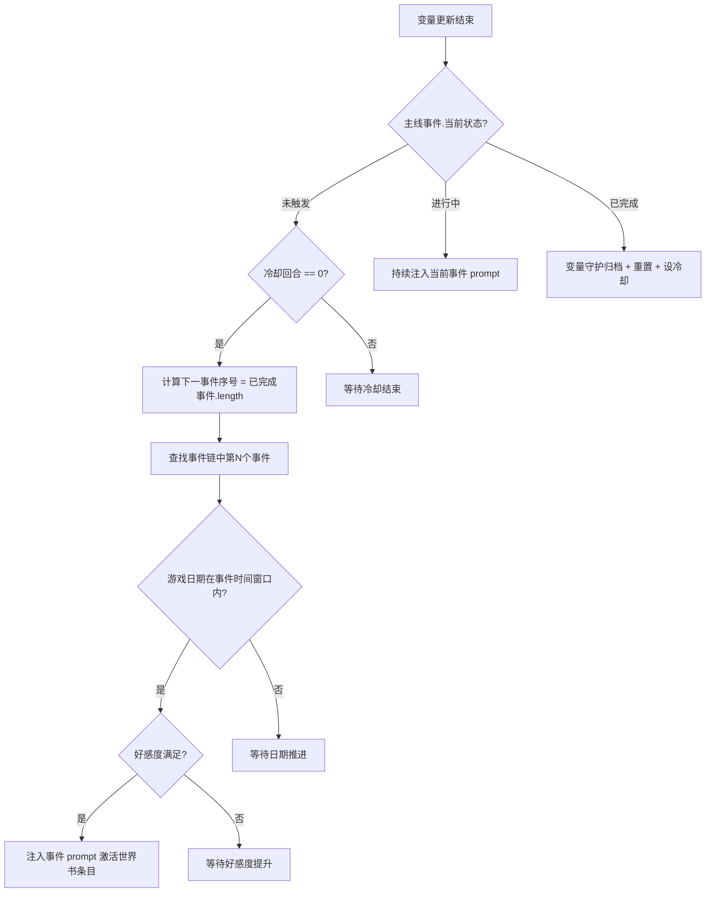

# 佩伊洛 · 主线事件系统设计

## 一、系统概述

主线事件系统是**链式顺序触发**的事件机制：
- 事件按固定顺序排列，完成事件N才能触发事件N+1
- 每个事件有**日期窗口**（游戏内日期匹配时才可触发）
- 同时满足好感度等条件后，通过脚本注入 prompt 激活世界书条目
- AI 根据世界书条目的指引推进事件剧情

## 二、Schema 扩展

### 新增字段

在 `世界` 对象中新增：

```ts
世界: z.object({
  当前日期: z.string(),     // 格式: YYYY/MM/DD，如 "2026/02/17"
  当前时间: z.string(),     // 原有，如 "黄昏"
  时间阶段: z.string(),     // 原有
  当前天气: z.string(),     // 新增：晴/多云/阴/小雨/中雨/暴雨/雪/雾 等
  当前地点: z.string(),     // 原有
  是否NSFW: z.boolean().prefault(false),
  下一回合界面选择: z.enum(['立绘', 'galgame']).prefault('立绘'),
}),
```

### 主线事件改造

增加 `事件ID` 字段来追踪当前激活的预定义事件：

```ts
主线事件: z.object({
  事件ID: z.string().prefault(''),        // 新增：对应预定义事件的标识
  当前状态: z.string().prefault('未触发'),
  当前阶段: z.enum(['引入', '发展', '高潮', '结局']).prefault('引入'),
  主题: z.string().prefault(''),
  描述: z.string().prefault(''),
  冷却回合: z.coerce.number().transform(v => Math.max(v, 0)).prefault(0),
  大纲: z.object({
    引入: z.string().prefault(''),
    发展: z.string().prefault(''),
    高潮: z.string().prefault(''),
    结局: z.string().prefault(''),
  }).prefault({}),
}).prefault({}),
```

## 三、事件链架构



### 事件链数据结构（定义在脚本中）

```ts
interface MainEvent {
  id: string;           // 事件标识，匹配世界书条目关键词
  name: string;         // 事件名称
  好感度要求: number;    // 最低好感度
  月份范围: [number, number]; // [起始月, 结束月]，如 [6, 7] 表示6-7月
  天气要求?: string[];  // 可选，限定天气条件
}

const EVENT_CHAIN: MainEvent[] = [
  { id: '事件1_xxx', name: '...', 好感度要求: 50, 月份范围: [2, 3] },
  { id: '事件2_xxx', name: '...', 好感度要求: 55, 月份范围: [3, 4] },
  { id: '事件3_海边旅行', name: '夏日海边旅行', 好感度要求: 65, 月份范围: [6, 7] },
  // ...更多事件
];
```

## 四、脚本分工

### 脚本/变量守护/index.ts（修改）

- 保留：好感度不足时阻止触发、完成时归档、冷却递减
- 新增：归档时记录 `事件ID`

### 脚本/主线事件/index.ts（新建）

核心职责：
1. 启动时检查当前事件状态
2. 从 `已完成事件.length` 确定下一事件序号
3. 解析游戏日期，判断是否在事件时间窗口内
4. 满足条件时调用 `injectPrompts` 注入关键词，激活对应世界书条目
5. 事件进行中时持续注入
6. 事件完成时取消注入

## 五、世界书结构

```
世界书/主线事件/
├── 事件1_xxx.yaml      # 第1个主线事件
├── 事件2_xxx.yaml      # 第2个主线事件
├── 事件3_海边旅行.yaml  # 第3个主线事件
└── ...
```

### 世界书条目 YAML 格式模板

```yaml
---
主线事件:
  name: 夏日海边旅行
  description: >
    佩伊洛看到日历已经进入夏天，想起以前和父母去过一次海边的模糊记忆，
    于是鼓起勇气提议和user一起去听涛区的金沙湾海滩。
  process:
    引入:
      - 佩伊洛在某次日常对话中提起想去海边
      - 表现出期待但又有些犹豫的样子
    发展:
      - 两人开始准备海边出行
      - 佩伊洛认真研究天气、准备防晒霜和遮阳帽（惜命特质）
    高潮:
      - 在海边，佩伊洛回忆起小时候和父母来过一次
      - 情绪涌上来，但选择和user分享而不是独自承受
    结局:
      - 两人在海边度过美好的一天
      - 佩伊洛在日记里记下这一天（执念特质）
  requirement:
    - 展现佩伊洛对新鲜事物的好奇（跨性格衍生：执念×温柔）
    - 体现惜命特质：认真准备防晒和安全措施
    - 自然融入对父母的回忆，但不要过于沉重
  rule:
    - 必须以合理的方式引入这个事件
    - 事件应自然融入当前叙事，不要突兀
    - 每个阶段至少持续2-3个回合
```

### 在 index.yaml 中的注册方式

```yaml
- 文件夹: 主线事件
  条目:
    - 名称: ===主线事件开始===
      <<: *分隔符

    - 名称: 主线·夏日海边旅行
      启用: true
      激活策略:
        类型: 关键词
        关键词: ['事件3_海边旅行']
      插入位置:
        类型: 指定深度
        角色: 系统
        深度: 0
        顺序: 14730
      递归:
        不可被其他条目激活: true
        不可激活其他条目: true
      文件: 世界书/主线事件/事件3_海边旅行

    - 名称: ===主线事件结束===
      <<: *分隔符
```

## 六、变量更新规则新增

```yaml
世界:
  当前日期:
    format: YYYY/MM/DD
    check:
      - 每次事件推进后合理更新日期
      - 日期不可倒退
      - 日常对话每回合推进约半天到一天
      - 周末、假期等应自然体现
  当前天气:
    check:
      - 参照澜景市气候特征，根据当前月份合理设定
      - 春季多阴雨，夏季高温或梅雨，秋季晴爽，冬季湿冷
      - 天气变化应自然，不要每回合都变
```

## 七、待确认事项

1. **具体事件列表**：你计划写哪些主线事件？每个事件的大致主题和时间窗口？
2. **日期跳过处理**：如果游戏日期已经超过某个事件的时间窗口（玩家推进太快），是跳过该事件还是强制回退触发？
3. **天气是否作为触发条件**：还是仅作为叙事参考？
