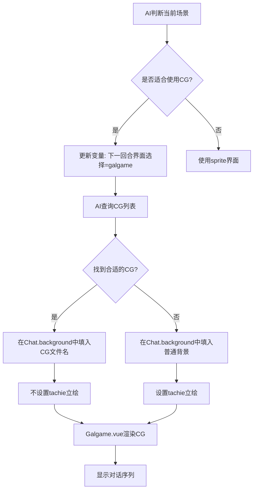

# 佩伊洛角色卡 CG 系统实现计划

## 📋 项目概述

为佩伊洛角色卡添加特殊CG图片显示功能，包括剧情CG和NSFW CG。实现逻辑：
1. 优先检查世界书中是否有适合当前场景的特殊CG
2. 如果有CG，在Galgame界面中显示CG（不显示立绘）
3. 如果没有CG，显示普通背景+立绘的形式

## 🎯 核心设计理念

参考 `galgame角色卡示例`（络络）的实现方式，CG系统的核心思路是：

### 工作流程



### 关键机制

**1. 统一的background字段**
- [`Galgame.vue`](src/佩伊洛/脚本/流式楼层界面/Galgame.vue:29) 的 `Chat` 接口中，`background` 字段既可以是普通背景，也可以是CG文件
- 前端组件不需要区分，统一通过 `background` 字段加载图片

**2. CG与立绘的互斥关系**
- 当使用CG时：`background` = CG文件路径，`tachie` 不设置（undefined）
- 当使用普通背景时：`background` = 背景文件路径，`tachie` = 立绘文件路径

**3. AI驱动的智能选择**
- AI通过世界书条目了解所有可用的CG文件
- AI根据当前场景（时间、地点、情感氛围）判断是否有合适的CG
- AI在输出时自主决定使用CG还是背景+立绘

## 📁 文件组织结构

### CG文件存放位置

```
背景/
├── CG/                          # 剧情关键CG
│   ├── 白天室内餐厅坐在桌子前用勺子吃饭.jpg
│   ├── 白天户外海边海鸥双手合十眺望远方.jpg
│   └── ...
├── NSFWCG/                      # NSFW CG
│   ├── 卧室床上拥抱.jpg
│   ├── 夜晚卧室床上亲吻.jpg
│   └── ...
├── 教室/
│   ├── 白天.jpg
│   └── ...
└── ...
```

### 命名规范

**关键CG命名格式**：`CG/${时间地点}${具体描述}.jpg`
- 示例：`CG/白天户外学校走廊站着拿着书包回头脸红微笑.jpg`
- 示例：`CG/黄昏户外日落海边站立脸红直视玩家.jpg`

**NSFW CG命名格式**：`NSFWCG/${时间}${地点}${具体描述}.jpg`
- 示例：`NSFWCG/卧室床上拥抱.jpg`
- 示例：`NSFWCG/夜晚卧室床上亲吻.jpg`

## 🗂️ 世界书条目设计

### 1. 文件-关键CG列表 [mvu_plot]

**文件路径**：[`src/佩伊洛/世界书/文件-关键CG.yaml`](src/佩伊洛/世界书/文件-关键CG.yaml)

**触发条件**：
```javascript
@@if getvar('stat_data.世界.下一回合界面选择') === 'galgame' && getvar('stat_data.世界.是否NSFW') === false
```

**内容结构**：
```yaml
---
关键CG列表:
  文件信息:
    格式: JPEG
    后缀: .jpg
  CG:
    白天室内:
      - 餐厅坐在桌子前用勺子吃饭
      - 教室里坐在钢琴前看向旁边表情平静
      - 客厅坐着被主视角喂食脸红地看着前方
    白天户外:
      - 海边海鸥双手合十眺望远方
      - 海边坐在防波堤上看着猫咪表情温柔
      - 街道上双手靠近脸颊脸红微笑
      - 躺在花海微笑
      - 学校道路上脸红回头看
      - 学校天台眺望等待
      - 学校走廊站着拿着书包回头脸红微笑
    傍晚户外:
      - 海边堤坝上站着脸红看向旁边
    黄昏户外:
      - 日落海边站立脸红直视玩家
    夜晚户外:
      - 拿冰可乐触碰佩伊洛脸颊嬉笑
      - 林间站着抬头看夜空
  调用格式: CG/${时间地点}${具体描述}.jpg
  调用示例:
    - CG/白天户外学校走廊站着拿着书包回头脸红微笑.jpg
    - CG/黄昏户外日落海边站立脸红直视玩家.jpg
    - CG/夜晚户外拿冰可乐触碰佩伊洛脸颊嬉笑.jpg
```

**世界书配置**：
- 位置：角色定义后
- 触发：绿灯（关键词：`关键CG,CG列表,剧情CG`）
- 顺序：50
- 递归：不可递归 + 防止进一步递归

### 2. 文件-NSFWCG列表 [mvu_plot]

**文件路径**：[`src/佩伊洛/世界书/文件-NSFWCG.txt`](src/佩伊洛/世界书/文件-NSFWCG.txt)

**触发条件**：
```javascript
@@if getvar('stat_data.世界.下一回合界面选择') === 'galgame' && getvar('stat_data.世界.是否NSFW') === true
```

**内容结构**：
```yaml
---
NSFWCG列表:
  文件信息:
    格式: JPEG
    后缀: .jpg
  NSFWCG:
    卧室: # 无时间指定
      - 床上拥抱
      - 床上亲吻
      - 床上抚摸
    夜晚:
      卧室:
        - 床上拥抱亲密
        - 床上亲吻深情
        - 床上抚摸温柔
      浴室:
        - 浴缸共浴
    白天:
      卧室:
        - 床上拥抱温馨
        - 性爱后拥抱
  调用格式: NSFWCG/${时间 if 时间}${地点}${具体描述}.jpg
  调用示例:
    - NSFWCG/卧室床上拥抱.jpg
    - NSFWCG/夜晚卧室床上拥抱亲密.jpg
    - NSFWCG/白天卧室性爱后拥抱.jpg
```

**世界书配置**：
- 位置：角色定义后
- 触发：绿灯（关键词：`NSFWCG,NSFW CG,R18 CG`）
- 顺序：50
- 递归：不可递归 + 防止进一步递归

### 3. 随机触发CG系统

**文件路径**：[`src/佩伊洛/世界书/随机触发CG.txt`](src/佩伊洛/世界书/随机触发CG.txt)

**触发条件**：
```javascript
@@if getvar('stat_data.佩伊洛.好感度') > 60 && !getvar('始终使用galgame界面')
```

**内容**：
```yaml
---
随机触发CG:
  rule: 你必须思考`关键CG列表`document中哪一张CG最适合当下场景与情节（若无CG适用，则允许不使用CG只使用背景和立绘），并在本次<UpdateVariable>中将`世界.下一回合界面选择`更新为'galgame'
  format: |-
    <UpdateVariable>
    ${将`世界.下一回合界面选择`更新为'galgame'}
    ...
    </UpdateVariable>
    <plot_hint>
    已将`世界.下一回合界面选择`更新为'galgame'，根据上文场景接下来的场景将使用特殊CG，我将采用CG文件：${`关键CG列表`document中存在的CG文件名}.jpg
    </plot_hint>
```

**世界书配置**：
- 位置：角色定义后
- 触发：蓝灯（常驻，但通过@@if条件控制）
- 顺序：45
- 递归：不可递归 + 防止进一步递归

### 4. 修改：下一回合界面选择 [mvu_plot]

**文件路径**：[`src/佩伊洛/世界书/下一回合界面选择.txt`](src/佩伊洛/世界书/下一回合界面选择.txt)

**需要修改的部分**：

**修改前（第30行）**：
```javascript
background: string; // `背景列表`中支持的当前所处地点位置、时间等的背景文件名
```

**修改后**：
```javascript
background: string; // `背景列表`中支持的当前所处地点位置、时间等的背景文件名，或`可调用的CG文件列表`中支持的CG文件名
```

**修改前（第31行）**：
```javascript
tachie?: string; // 如果佩伊洛在场，从`立绘列表`中选择存在的佩伊洛立绘文件名, 否则不设置
```

**修改后**：
```javascript
tachie?: string; // 如果佩伊洛在场且background不是CG文件，从`立绘列表`中选择存在的佩伊洛立绘文件名, 否则不设置
```

**在第24行后添加**：
```javascript
可调用的CG文件列表: <%= getvar('stat_data.世界.是否NSFW') === true ? '`NSFWCG列表`document' : '`关键CG列表`document' %>
```

**修改format部分（第38-44行）**：
```yaml
format: |-
  <interface_analysis>
  - 当前时间: ...
  - 角色所在地点: ...
  - `可调用的CG文件列表`中是否有对应于当前时间、角色所在地点和剧情氛围的CG: yes/no
    - 将使用CG: ...
    - 由于使用了CG，将不显示任何立绘
  - 将使用的`背景列表`中的背景: ...
  - 将使用的`立绘列表`中的立绘: ...
  </interface_analysis>
  <galgame>
  ```yaml
  ${按YAML格式输出Chat[]（不少于10个Chat，不多于25个Chat），营造一个符合场景风格的、具有充足情感爆发的CG场景，留给玩家深刻印象，要注重于单个CG场景的深刻描写，禁止过于频繁地切换CG}
  ```
  </galgame>
```

### 5. 修改：下一回合界面选择强调 [mvu_plot]

**文件路径**：[`src/佩伊洛/世界书/下一回合界面选择强调.txt`](src/佩伊洛/世界书/下一回合界面选择强调.txt)

**需要修改的部分**：

**修改前（第15行）**：
```javascript
rule: "by recalling `下一回合界面选择系统`, `背景列表`, `立绘列表` documents, the following must be inserted to the reply and cannot be omitted"
```

**修改后**：
```javascript
rule: "by recalling `下一回合界面选择系统`, `背景列表`, `立绘列表`, `<%= getvar('stat_data.世界.是否NSFW') ? `NSFWCG列表` : `关键CG列表` %>` documents, the following must be inserted to the reply and cannot be omitted"
```

## 🎨 前端组件分析

### Galgame.vue 组件现状

查看 [`Galgame.vue`](src/佩伊洛/脚本/流式楼层界面/Galgame.vue) 的实现：

**第66-73行：背景和立绘加载逻辑**
```typescript
const bgUrl = computed(() => {
  if (!current.value?.background) return 'none';
  return `url(${CDN}/背景/${current.value.background})`;
});
const tachieUrl = computed(() => {
  if (!current.value?.tachie) return '';
  return `${CDN}/角色立绘/${current.value.tachie}`;
});
```

**✅ 结论：前端组件无需修改**

原因：
1. `background` 字段已经支持任意路径，无论是 `教室/白天.jpg` 还是 `CG/白天户外学校走廊站着拿着书包回头脸红微笑.jpg`，都会被正确拼接为 `${CDN}/背景/${background}`
2. `tachie` 字段是可选的（`tachie?:`），当AI不设置时自然不显示立绘
3. 组件已经完美支持CG显示逻辑，无需任何改动

## 📝 AI输出示例

### 使用CG的情况

```yaml
<interface_analysis>
- 当前时间: 黄昏
- 角色所在地点: 海边
- `关键CG列表`中是否有对应于当前时间、角色所在地点和剧情氛围的CG: yes
  - 将使用CG: CG/黄昏户外日落海边站立脸红直视玩家.jpg
  - 由于使用了CG，将不显示任何立绘
</interface_analysis>
<galgame>
```yaml
- speaker: 旁白
  speech: 夕阳将整片海面染成了金红色，海风轻轻吹拂着佩伊洛的白发。
  background: CG/黄昏户外日落海边站立脸红直视玩家.jpg
- speaker: 佩伊洛
  speech: 今天的日落真美呢...和你一起看，感觉更加特别了。
  background: CG/黄昏户外日落海边站立脸红直视玩家.jpg
- speaker: <user>
  speech: 是啊，这个时刻我想永远记住。
  background: CG/黄昏户外日落海边站立脸红直视玩家.jpg
```
</galgame>
```

### 不使用CG的情况

```yaml
<interface_analysis>
- 当前时间: 白天
- 角色所在地点: 教室
- `关键CG列表`中是否有对应于当前时间、角色所在地点和剧情氛围的CG: no
- 将使用的`背景列表`中的背景: 教室/白天.jpg
- 将使用的`立绘列表`中的立绘: 校服/微笑.png
</interface_analysis>
<galgame>
```yaml
- speaker: 佩伊洛
  speech: 今天的课程好难啊，你能教教我吗？
  background: 教室/白天.jpg
  tachie: 校服/微笑.png
- speaker: <user>
  speech: 当然可以，我们一起看看这道题。
  background: 教室/白天.jpg
  tachie: 校服/星星眼.png
```
</galgame>
```

## 🔄 实现步骤

### 阶段一：准备CG文件（用户完成）

- [ ] 准备剧情关键CG图片
- [ ] 准备NSFW CG图片（可选）
- [ ] 按照命名规范重命名文件
- [ ] 将文件放入 `背景/CG/` 和 `背景/NSFWCG/` 目录

### 阶段二：创建世界书条目

- [ ] 创建 [`src/佩伊洛/世界书/文件-关键CG.yaml`](src/佩伊洛/世界书/文件-关键CG.yaml)
- [ ] 创建 [`src/佩伊洛/世界书/文件-NSFWCG.txt`](src/佩伊洛/世界书/文件-NSFWCG.txt)
- [ ] 创建 [`src/佩伊洛/世界书/随机触发CG.txt`](src/佩伊洛/世界书/随机触发CG.txt)

### 阶段三：修改现有条目

- [ ] 修改 [`src/佩伊洛/世界书/下一回合界面选择.txt`](src/佩伊洛/世界书/下一回合界面选择.txt)
- [ ] 修改 [`src/佩伊洛/世界书/下一回合界面选择强调.txt`](src/佩伊洛/世界书/下一回合界面选择强调.txt)

### 阶段四：配置世界书

在 [`src/佩伊洛/index.yaml`](src/佩伊洛/index.yaml) 中添加新条目的配置：

```yaml
世界书:
  条目:
    # ... 现有条目 ...

    - 名称: 文件-关键CG
      启用: true
      触发策略: 绿灯
      关键词: 关键CG,CG列表,剧情CG
      位置: 角色定义后
      顺序: 50
      递归: 不可递归 + 防止进一步递归
      内容文件: 世界书/文件-关键CG.yaml

    - 名称: 文件-NSFWCG
      启用: true
      触发策略: 绿灯
      关键词: NSFWCG,NSFW CG,R18 CG
      位置: 角色定义后
      顺序: 50
      递归: 不可递归 + 防止进一步递归
      内容文件: 世界书/文件-NSFWCG.txt

    - 名称: 随机触发CG
      启用: true
      触发策略: 蓝灯
      位置: 角色定义后
      顺序: 45
      递归: 不可递归 + 防止进一步递归
      内容文件: 世界书/随机触发CG.txt
```

### 阶段五：测试验证

- [ ] 测试普通场景（应显示背景+立绘）
- [ ] 测试情感高潮场景（应触发CG）
- [ ] 测试NSFW场景（应显示NSFW CG）
- [ ] 验证CG与立绘的互斥关系
- [ ] 验证AI能正确选择合适的CG

## ⚠️ 注意事项

### 1. CG文件路径

所有CG文件必须放在 `背景/` 目录下的子目录中：
- `背景/CG/xxx.jpg` ✅
- `CG/xxx.jpg` ❌（错误，会找不到文件）

### 2. 文件命名一致性

世界书中列出的CG文件名必须与实际文件名完全一致（包括大小写）。

### 3. 触发条件

`随机触发CG.txt` 的触发条件可以根据实际需求调整：
- 当前设置：好感度 > 60
- 可以改为其他条件，如特定事件、特定时间等

### 4. CG数量控制

建议每个场景类型准备2-5张CG，避免：
- CG太少：AI找不到合适的CG
- CG太多：增加AI选择负担，可能选择不当

### 5. 世界书条目顺序

确保条目加载顺序正确：
1. 随机触发CG（顺序45）- 先判断是否触发
2. 文件-关键CG/NSFWCG（顺序50）- 提供CG列表
3. 下一回合界面选择（D0深度）- 指导输出格式

## 🎯 预期效果

实现后，AI将能够：

1. **智能判断场景**：根据剧情发展自动判断是否适合使用CG
2. **精准选择CG**：从CG列表中选择最符合当前场景的CG
3. **优雅降级**：如果没有合适的CG，自动使用背景+立绘
4. **沉浸式体验**：在关键情感场景展示精美CG，提升玩家体验

## 📚 参考资料

- galgame角色卡示例（络络）：[`galgame角色卡示例/`](galgame角色卡示例/)
- 当前Galgame组件：[`src/佩伊洛/脚本/流式楼层界面/Galgame.vue`](src/佩伊洛/脚本/流式楼层界面/Galgame.vue)
- 世界书配置指南：[`.kilocode/rules/世界书配置指南.md`](.kilocode/rules/世界书配置指南.md)

---

**计划制定时间**：2026-05-14
**计划制定者**：秋青子（Kiro AI助手）
