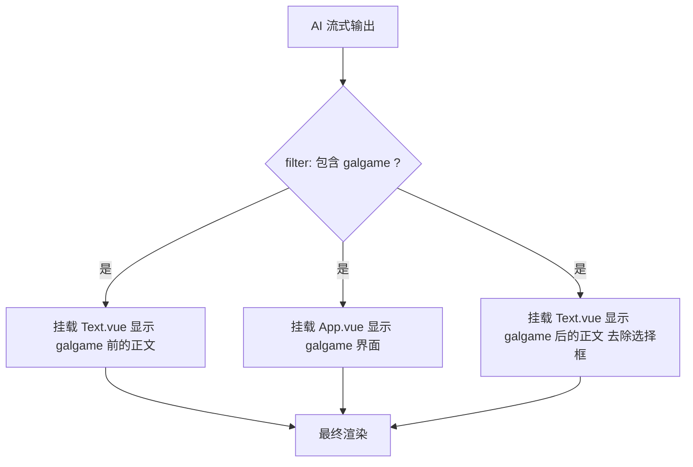
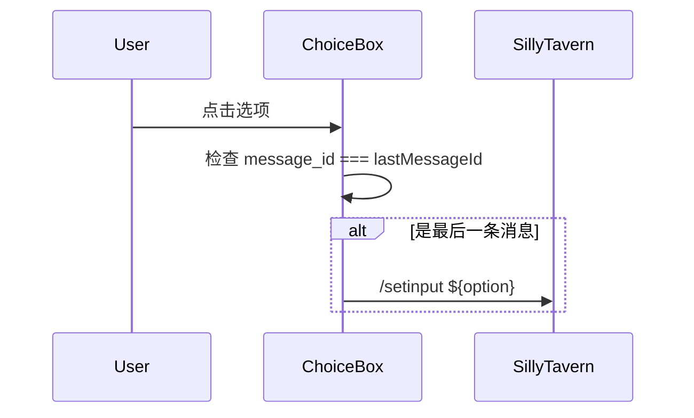

# 佩伊洛专属流式 Galgame 界面设计方案

> 参照 [`galgame角色卡示例/`](../galgame角色卡示例/) (络络/日记络络) 的成熟架构，为佩伊洛设计专属的流式 galgame 界面。本方案**仅重做 galgame 模式**，sprite 模式的正则+iframe 选择框 ([`src/佩伊洛/正则/内嵌选择框标签.txt`](../src/佩伊洛/正则/内嵌选择框标签.txt)) 保持现状不动。

---

## 一、核心目标与「流式生成」原理拆解

### 用户痛点回顾

> *"AI 输出时就已经输出完整的界面，然后在界面流式生成文字，同时也具备选择框的功能"*
> *"选择框在普通的文字附立绘的状态下完全不会影响到正文"*

### 络络是怎么做到的（关键代码定位）

1. **挂载时机**: [`mountStreamingMessages`](../galgame角色卡示例/脚本/galgame/index.ts:11) 通过 `filter: msg => msg.includes('<galgame>')` 检测——**AI 一旦输出 `<galgame>` 标签头**，Vue 容器立即挂载，**整个界面外壳瞬间出现**。
2. **数据响应**: [`App.vue`](../galgame角色卡示例/脚本/galgame/App.vue:64) 中 `watchImmediate(() => context.message, ...)` 监听消息变化——AI 每输出几个字符，[`store.loadMessage()`](../galgame角色卡示例/脚本/galgame/store.ts:69) 重新解析 YAML。
3. **容错解析**: [`parseDialogsFromMessage`](../galgame角色卡示例/脚本/galgame/store.ts:4) 用两个正则（FULL 闭合 + PARTIAL 未闭合）兼容流式中途的不完整 YAML，**每条对话独立 zod 校验**，失败的 fallback 为 `'failed'` 后过滤掉。
4. **打字动画**: [`DialogBox.vue`](../galgame角色卡示例/脚本/galgame/components/DialogBox.vue:64) 使用 `gsap.SplitText` 对当前 dialog 的文字按字符切分 + stagger 淡入，watch `current_index` 触发新一轮打字。
5. **选择框分离**: 络络的选择框在 sprite 模式下由[**独立脚本**](../galgame角色卡示例/脚本/选择框/index.ts:1) 通过 DOM 操作渲染，不通过流式楼层界面（这就是「不影响正文」的本质）；在 galgame 模式下，选择框作为 `ChoiceBox.vue` 内嵌在 galgame 容器底部，仅在 `store.has_ended` 时显示。

**佩伊洛的现状**：sprite 选择框已经用正则+iframe 实现，完全独立于流式楼层界面（[`内嵌选择框标签.txt`](../src/佩伊洛/正则/内嵌选择框标签.txt)），等同于络络方案的另一种实现，**这部分继续沿用**。本方案只重做 galgame 流式界面。

---

## 二、文件结构改动

### 2.1 重写 `src/佩伊洛/脚本/流式楼层界面/`

```
src/佩伊洛/脚本/流式楼层界面/
├── index.ts              # 入口，挂载 3 个 mountStreamingMessages
├── store.ts              # Pinia store - 对话/选项/UI 状态
├── type.ts               # Chat / Character zod schema
├── App.vue               # galgame 主容器（取代旧 Galgame.vue）
├── Text.vue              # galgame 前/后的正文显示（仅 transformer 不同）
└── components/
    ├── SceneStage.vue    # 场景层（背景图 + Transition）
    ├── CharacterLayer.vue # 立绘层（多角色定位 + 说话高亮）
    ├── DialogBox.vue     # 对话框（gsap 打字效果）
    ├── ChoiceBox.vue     # 选择框（galgame 结束后从底部淡入）
    ├── ControlBar.vue    # 控制栏（重播/进度/日志/隐藏UI/CG放大）
    └── HistoryPanel.vue  # 历史对话弹层
```

### 2.2 删除（被新文件取代）

- [`src/佩伊洛/脚本/流式楼层界面/Galgame.vue`](../src/佩伊洛/脚本/流式楼层界面/Galgame.vue) → 拆分为 `App.vue` + `components/*`
- [`src/佩伊洛/脚本/流式楼层界面/RoleplayOptions.vue`](../src/佩伊洛/脚本/流式楼层界面/RoleplayOptions.vue) → 由 `components/ChoiceBox.vue` 取代

### 2.3 保持不动

- `src/佩伊洛/世界书/下一回合界面选择.txt`（galgame 模式的 `<galgame>` YAML 格式已经够用，只需在示例中加一句"CG 场景时 background 填 `CG/xxx.jpg` 且不设置 tachie"）
- `src/佩伊洛/正则/内嵌选择框标签.txt`（sprite 模式选择框 100% 保留）
- `src/佩伊洛/世界书/选择框.txt`、`选择框强调.txt`（输出格式不变）

---

## 三、视觉风格设计（待用户审定）

### 3.1 色板（基于佩伊洛形象提取）

| 角色        | 色值                        | 来源                                                                                           |
| ----------- | --------------------------- | ---------------------------------------------------------------------------------------------- |
| 主色·红瞳红 | `#d4616f`                   | 红色瞳孔，呼应已有正则 [`内嵌选择框标签.txt`](../src/佩伊洛/正则/内嵌选择框标签.txt:52) 的配色 |
| 辅色·发卡蓝 | `#5b88a8`                   | 蓝色蝴蝶发卡                                                                                   |
| 背景·雪白   | `#fefcfa`                   | 白色长发                                                                                       |
| 深色文字    | `#3d2b35`                   | 沉稳暗红棕                                                                                     |
| 对话框底    | `rgba(254, 252, 250, 0.93)` | 雪白半透明                                                                                     |
| 分割线      | `rgba(212, 97, 111, 0.55)`  | 红色淡化                                                                                       |
| 发言人名字  | `#b54858`                   | 红色加深，标识身份                                                                             |

### 3.2 装饰元素

- **顶部标题栏**：`『 ✦  𝓟𝓮𝔂𝓻𝓸  ✦ 』`（红蓝渐变背景 `linear-gradient(to right, #d4616f33, #5b88a833)`）
- **蝴蝶 🦋 与雪花 ❄ 点缀**：呼应蓝蝴蝶发卡与雪女气质（角落 0.7 透明度）
- **选择框装饰**：左侧红蓝渐变细线（`linear-gradient(to bottom, #d4616f, #5b88a8)`）+ 红色圆点（呼应红瞳）
- **打字光标**：闪烁的红色「∣」

### 3.3 对比络络（粉色甜系）

| 元素 | 络络                       | 佩伊洛（建议）              |
| ---- | -------------------------- | --------------------------- |
| 主色 | 粉色 `#ffd0d8` / `#ffbbc8` | 红 `#d4616f` + 蓝 `#5b88a8` |
| 装饰 | 樱花 `❀` + 爱心 `♡`        | 蝴蝶 `🦋` + 雪花 `❄`         |
| 标题 | 「𝒞𝒢𝒯𝒾𝓂ℯ」（甜系手写）     | 「𝓟𝓮𝔂𝓻𝓸」（红蓝渐变）       |
| 气质 | 温馨甜美                   | 优雅清冷                    |

> **如果你希望换风格**（如暗夜系/校园系/极简系），告诉我后我会调整色板与装饰。

---

## 四、流式渲染分层（核心架构）

### 4.1 [`index.ts`](../src/佩伊洛/脚本/流式楼层界面/index.ts) 重写

参照 [络络 index.ts](../galgame角色卡示例/脚本/galgame/index.ts)，挂载 **3 个独立的 mountStreamingMessages**：



- **第 1 个 Text.vue**: `transformer = msg => msg.slice(0, msg.lastIndexOf('<galgame>')).trim()` → galgame 标签前的正文（一般为空，但保留扩展性）
- **第 2 个 App.vue**: galgame 主界面（含选择框）
- **第 3 个 Text.vue**: `transformer` 去除 `</galgame>` 之前的所有内容 + 去除 `<roleplay_options>` 段落 → galgame 后的正文（一般是空的 UpdateVariable 等已被其它正则折叠掉的内容）

### 4.2 [`store.ts`](../src/佩伊洛/脚本/流式楼层界面/store.ts) 数据模型

```typescript
// 伪代码
useGalgameStore = defineStore('peyro-galgame', () => {
  const dialogs = ref<Dialog[]>([])      // 解析的对话序列
  const options = ref<string[]>([])      // 选项
  const current_index = ref(0)           // 当前播放到第几句
  const during_streaming = ref(false)    // 流式中
  const has_ended = ref(false)           // 播放结束（→ 显示选择框）

  const current_dialog = computed(...)
  const history_dialogs = computed(...)  // 切片到 current_index + 1
  const is_cg = computed(() =>           // CG 模式判定
    current_dialog.value?.background?.startsWith('CG/'))

  loadMessage(message)  // 流式解析 + 容错（参照络络）
  advance()              // 推进到下一句
  restart()              // 回到第一句

  // UI 状态
  const dialog_opened = ref(true)        // 隐藏 UI 时关闭
  const history_opened = ref(false)      // 历史日志开关
})
```

### 4.3 [`type.ts`](../src/佩伊洛/脚本/流式楼层界面/type.ts) 类型定义

参照 [络络 type.ts](../galgame角色卡示例/脚本/galgame/type.ts)：

```typescript
const Character = z.object({ id: z.string(), tachie: z.string() })
const 佩伊洛专用 = z.object({
  speaker: z.string(),
  speech: z.string(),
  background: z.string(),
  tachie: z.string().optional(),
}).transform(data => ({
  ...omit(data, 'tachie'),
  characters: data.tachie ? [{ id: '佩伊洛', tachie: data.tachie }] : [],
}))
// 旁白/独白特殊处理：speaker 显示为空，独白自动加括号
```

### 4.4 容错解析（流式关键）

采用络络 [`parseDialogsFromMessage`](../galgame角色卡示例/脚本/galgame/store.ts:4) 同款双正则方案：

- `FULL_REGEX`: 匹配完整闭合的 `<galgame>...</galgame>`
- `PARTIAL_REGEX`: 匹配未闭合的 `<galgame>` 开放尾部
- 单条对话用 `Dialog.or('failed').catch('failed')` 容错
- 流式中若解析失败，**保持上次成功的 dialogs**（避免界面闪烁）

---

## 五、组件设计要点

### 5.1 [`App.vue`](../src/佩伊洛/脚本/流式楼层界面/App.vue) 主容器

```html
<div class="aspect-video max-md:aspect-[3/4]" @click="handleAdvance">
  <顶部标题栏 />          <!-- 『 ✦  𝓟𝓮𝔂𝓻𝓸  ✦ 』 -->
  <SceneStage />          <!-- 背景 + 立绘 -->
  <ChoiceBox v-if="store.has_ended" />
  <DialogBox v-show="store.dialog_opened" ref="dialog_box" />
  <HistoryPanel v-if="store.history_opened" />
  <ControlBar />
</div>
```

- **点击推进逻辑**: 历史面板打开 / 已结束 → 不响应；正在打字 → 立即跳过打字；否则 → `store.advance()`
- **双向数据绑定**: `watchImmediate(() => context.during_streaming, ...)` 与 `watchImmediate(() => context.message, ...)`

### 5.2 [`SceneStage.vue`](../src/佩伊洛/脚本/流式楼层界面/components/SceneStage.vue) + CharacterLayer

- **背景切换**: Vue `<Transition name="bg-fade">` 1.2s 淡入淡出（首次切换无动画）
- **CG 模式**:
  - `is_cg = true` 时，背景 `object-fit: contain`（保留 CG 完整比例，黑边留白）
  - CG 模式下**不渲染**立绘层
  - 对话框底色加深 `rgba(0,0,0,0.7)` 提升 CG 上文字可读性
- **立绘层（CharacterLayer）**:
  - 单角色居中 50%
  - 多角色按 `index / (n+1)` 自动分布（参照络络）
  - 说话角色亮色，其它降低饱和度 `brightness(0.85) contrast(0.95)`

### 5.3 [`DialogBox.vue`](../src/佩伊洛/脚本/流式楼层界面/components/DialogBox.vue) 对话框

```html
<div class="absolute bottom-0 w-full">
  <发言人名字 />        <!-- #b54858 红色加粗 -->
  <红蓝渐变分割线 />
  <台词正文 ref="content" />  <!-- gsap SplitText 打字 -->
</div>
```

- **打字效果**:
  - watch `store.current_index` → 触发 `startTyping()`
  - `gsap.SplitText(content, { type: 'chars' })` 切分字符
  - `gsap.from(split.chars, { opacity: 0, duration: 0.1, stagger: 0.04 })`
  - 暴露 `is_typing` 和 `stopTyping()` 给 App.vue
- **CG 模式样式切换**:
  - 普通模式：白色半透明底 `rgba(254,252,250,0.93)`，深棕文字
  - CG 模式：深色半透明底 `rgba(0,0,0,0.7)`，白色文字
- **底部渐变蒙版**: 上方 transparent → 下方半透明，模仿视觉小说阴影

### 5.4 [`ChoiceBox.vue`](../src/佩伊洛/脚本/流式楼层界面/components/ChoiceBox.vue) 选择框（galgame 内嵌版）

- 仅在 `store.has_ended === true` 时显示
- 从底部 10px 偏移淡入（参照络络的 `<Transition name="choice-fade">`）
- **样式**: 左侧红蓝渐变细线 + 红色圆点 + 半透明白底 + 雪花点缀
- **点击行为**: `triggerSlash('/setinput ${option}')`（与现有 [`RoleplayOptions.vue`](../src/佩伊洛/脚本/流式楼层界面/RoleplayOptions.vue:46) 一致，不直接发送）



### 5.5 [`ControlBar.vue`](../src/佩伊洛/脚本/流式楼层界面/components/ControlBar.vue) 控制栏

右上角悬浮按钮组（参照络络 [`ControlBar.vue`](../galgame角色卡示例/脚本/galgame/components/ControlBar.vue)）：

| 按钮                | 功能                                                                     |
| ------------------- | ------------------------------------------------------------------------ |
| `重播` / `1/N`      | 已结束 → 重播；进行中 → 显示当前进度 `current+1/total`（流式时附加 `?`） |
| `日志`              | 打开历史对话面板                                                         |
| `隐藏UI` / `显示UI` | 切换 `dialog_opened`（方便欣赏立绘和 CG）                                |
| `放大`              | 仅 CG 模式显示，调用 SillyTavern 的 Popup 大图查看                       |

### 5.6 [`HistoryPanel.vue`](../src/佩伊洛/脚本/流式楼层界面/components/HistoryPanel.vue) 历史面板

- 全屏蒙版 + 浮层卡片
- 滚动列表，每条对话独立卡片
- 雪花/蝴蝶装饰
- 关闭按钮 `⊗`
- 挂载时自动滚到底

---

## 六、CG 模式详解（预留实现，无图也能跑）

### 6.1 触发方式

AI 在 YAML 中输出形如：

```yaml
- speaker: 旁白
  speech: 樱花纷飞的瞬间，时间仿佛停止了。
  background: CG/告白时刻.jpg
  # 不设置 tachie
```

前端通过 `background.startsWith('CG/')` 自动识别。

### 6.2 CG 模式 vs 普通模式对比

| 维度                  | 普通模式                    | CG 模式                                   |
| --------------------- | --------------------------- | ----------------------------------------- |
| `background` 路径前缀 | `教室/`、`学校屋顶/` 等     | `CG/`                                     |
| 背景填充              | `object-fit: cover`（铺满） | `object-fit: contain`（保留比例）         |
| 立绘层                | 显示                        | **隐藏**                                  |
| 对话框底色            | 白色半透明                  | 深色半透明（保证 CG 上文字可读）          |
| 文字颜色              | 深棕 `#3d2b35`              | 白色 `#fefcfa`                            |
| 控制栏额外按钮        | 无                          | `放大` 按钮（SillyTavern.Popup 大图查看） |

### 6.3 当前 CG 缺失的优雅降级

- CDN 上 `CG/xxx.jpg` 不存在 → `` 的 `onerror` 触发 → 显示纯黑背景 + 文字"（CG 图片加载失败）"
- **不影响主流程**：只是显示效果略差，对话依然正常推进

### 6.4 世界书提示（可选小修改）

在 [`下一回合界面选择.txt`](../src/佩伊洛/世界书/下一回合界面选择.txt) 的 galgame format 示例 (`example`) 中**追加一个 CG 示例**：

```yaml
- speaker: 旁白
  speech: 樱花纷飞，佩伊洛抬起头，红色的眼睛里映着粉白的花瓣。
  background: CG/樱花树下告白.jpg
  # 注意：使用 CG 时不设置 tachie
```

并在 rule 中加一句：

> 如果想用 CG（如告白、第一次牵手等情感爆发瞬间），将 `background` 填为 `CG/xxx.jpg` 且**不设置 `tachie`**；CG 文件需在世界书的 `CG列表` 中存在（目前为空，CG 添加后再启用）。

**这一步可以等 CG 资源就绪后再加，当前不动也行。**

---

## 七、AI 输出格式（无需大改世界书）

现有 [`下一回合界面选择.txt`](../src/佩伊洛/世界书/下一回合界面选择.txt:54) 中的 `<galgame>` 格式已经完全匹配新方案的解析逻辑：

```
<galgame>
```yaml
- speaker: 佩伊洛
  speech: 今天的风有点大呢，走在路上差点被吹跑了！
  background: 学校路上/白天.jpg
  tachie: 校服/微笑.png
- speaker: 旁白
  speech: 风吹过樱花林，粉白的花瓣像雪一样飘落。
  background: 樱花街/白天.jpg
- speaker: <user>
  speech: 我也觉得今天的景色特别美。
  background: 学校路上/白天.jpg
```
</galgame>

<roleplay_options>
```
温柔回应：「确实，和你在一起看的风景都是最美的。」
逗她一下：故意吹气把花瓣吹到她脸上
继续追问：「你呢？最喜欢哪一种花？」
```
</roleplay_options>
```

**唯一可选改动**：在 example 后追加 CG 用法示例（见 6.4）。

---

## 八、技术依赖检查

| 依赖                              | 用途                   | 现状                                                                           |
| --------------------------------- | ---------------------- | ------------------------------------------------------------------------------ |
| `vue` + `pinia`                   | 框架                   | ✅ 已在 package.json                                                            |
| `gsap` + `gsap/SplitText`         | 打字动画               | 需确认（络络项目用了，应该已经安装）                                           |
| `yaml`                            | 解析 YAML              | ✅ 现有 [Galgame.vue](../src/佩伊洛/脚本/流式楼层界面/Galgame.vue:15) 已 import |
| `zod`                             | 类型校验               | ✅ 全局可用                                                                     |
| `@util/streaming`                 | mountStreamingMessages | ✅ tavern_helper_template 内置                                                  |
| `lodash` (`_`) / `klona`          | 工具                   | ✅ 全局可用                                                                     |
| `auto-imports` (ref/computed/...) | Vue 组合式自动导入     | ✅ 配置完毕                                                                     |

**风险点**: 需要 `pnpm list gsap` 确认 gsap 已安装；如未安装，需 `pnpm add gsap`。

---

## 九、与现有架构的兼容性

### 9.1 不破坏的地方

- ✅ Sprite 模式选择框（正则+iframe）完全不动
- ✅ MVU 变量系统不动
- ✅ 现有正则规则不动
- ✅ 世界书 `下一回合界面选择.txt` 仅可选追加 CG 示例
- ✅ 第一条消息（含 `<sprite>`）不动

### 9.2 流式楼层界面 filter 行为

```typescript
filter: (_id, message) => /<galgame>/.test(message)
```

- 仅 galgame 模式的消息进入 Vue 渲染
- sprite 模式消息**不挂载 Vue**，由现有的正则/iframe 处理 → 不会影响正文显示
- 这就是「**选择框在普通的文字附立绘的状态下完全不会影响到正文**」的实现底层

### 9.3 与"始终galgame界面"开关的兼容

现有的 [`始终galgame界面控制器.txt`](../src/佩伊洛/世界书/始终galgame界面控制器.txt) 会强制 `下一回合界面选择=galgame` → AI 输出 `<galgame>` → filter 匹配 → 新界面渲染。**完全兼容**。

---

## 十、实现拆解（todo 概览）

```mermaid
graph LR
    A[1.依赖检查 gsap] --> B[2.创建 type.ts]
    B --> C[3.创建 store.ts]
    C --> D[4.创建 Text.vue]
    D --> E[5.创建 SceneStage+CharacterLayer]
    E --> F[6.创建 DialogBox 含打字]
    F --> G[7.创建 ChoiceBox]
    G --> H[8.创建 ControlBar+HistoryPanel]
    H --> I[9.重写 App.vue]
    I --> J[10.重写 index.ts]
    J --> K[11.删除旧 Galgame/RoleplayOptions]
    K --> L[12.可选 加CG 示例到世界书]
    L --> M[13.构建+本地测试]
```



详细 todo 见对话中的 update_todo_list 输出。

---

## 十一、视觉预览（文字描述）

> 当 AI 开始输出 `<galgame>` 标签的那一刻：

```
┌────────────────────────────────────────┐
│ ✦                 𝓟𝓮𝔂𝓻𝓸                ✦│  ← 红蓝渐变标题栏
├────────────────────────────────────────┤
│                              [重播 进度 日志] │  ← 控制栏
│                                        │
│            [背景图淡入]                  │
│                                        │
│           ┌──────────┐                  │
│           │  立绘     │                  │
│           │ （说话者 │                  │
│           │  高亮）   │                  │
│           └──────────┘                  │
│ ❄                                    🦋  │  ← 装饰元素
├────────────────────────────────────────┤
│ 佩伊洛                                  │  ← 红色加粗发言人
│ ─────────────                          │  ← 红蓝渐变细线
│ 今天的风有点大呢，走在路上差……          │  ← gsap 打字动画
└────────────────────────────────────────┘

[AI 流式完成后，最后一句播完]
        ┌─────────────────────┐
        │ ● 温柔回应          │  ← 红圆点 + 红蓝渐变左侧条
        │   「确实，和你在……」│
        ├─────────────────────┤
        │ ● 逗她一下          │
        │   故意吹气把花瓣……│
        ├─────────────────────┤
        │ ● 继续追问          │
        │   「你呢？最喜欢……」│
        └─────────────────────┘
```

> CG 模式下：背景按比例完整显示（黑边），立绘消失，对话框变深色。

---

## 十二、待用户确认的细节

1. **视觉风格**: 上面提议的「红+蓝+白·优雅清冷」是否符合期望？还是想换其它风格（如暗夜系/校园系/极简系/复古系）？
2. **打字速度**: 默认 `stagger 0.04s/字`（与络络一致，约 25 字/秒），是否调整？
3. **是否需要"快进"按钮**: 长按或点击跳过整段 galgame 直接到选择框？（络络没做这个）
4. **选择框默认位置**: galgame 内嵌选择框放在**屏幕中央**（络络方式，更醒目）还是**对话框上方**（更紧凑）？
5. **是否启用 CG 示例追加到世界书**: 现在加 / 等 CG 资源就绪再加 / 不加（由 AI 自己理解 CG/ 前缀）？

---

## 十三、风险与回退方案

| 风险                                         | 缓解                                                             |
| -------------------------------------------- | ---------------------------------------------------------------- |
| gsap 未安装                                  | 实现阶段先 `pnpm add gsap`，或回退到 CSS `@keyframes` 字符级动画 |
| 流式解析在 AI 输出超慢时频繁失败导致界面闪烁 | 已在 store 中实现「失败保持上次成功结果」策略                    |
| 旧 `Galgame.vue` 删除前的并行存在            | 实现时新文件先建好并跑通，最后一步才删旧文件                     |
| 用户切回 sprite 模式发现选择框冲突           | filter 仅匹配 `<galgame>`，sprite 消息完全不进入新界面，零冲突   |

---

> **下一步**: 等待你审阅本方案。批准后我会切换到 Code 模式开始实现。
