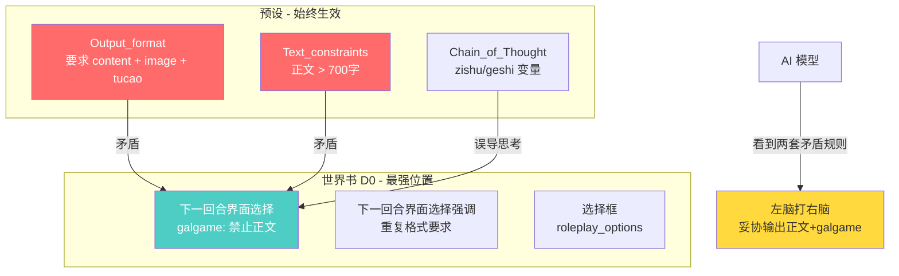

# 修复预设与 Galgame 界面规则冲突（更新版）

> **更新**：`<tucao>` 标签保留输出（吐槽/摘要不影响 galgame 界面），仅跳过 `<content>` 和 `<image>`。

## 问题描述

AI 在 galgame 模式下产生"左脑打右脑"现象：**预设**和**世界书**给出了互相矛盾的输出格式指令，AI 无法同时满足两者，只能妥协输出。

## 冲突分析

### 冲突方 A：预设（始终生效，变量硬编码）

```
<Output_format>
  <content>{简体中文正文内容}</content>    ← 要求必须输出正文
  <image> × 3                             ← 要求必须输出3张图片
  <tucao>{吐槽}</tucao>                    ← 要求必须输出吐槽
  {根据其它指令生成的剩余格式内容}
</Output_format>

<Chain_of_Thought>
  {{getvar::zishu}}     ← 字数要求（约700字+）
  {{getvar::geshi}}     ← 格式要求
</Chain_of_Thought>
```

### 冲突方 B：世界书 galgame 规则（D0 深度）

[`下一回合界面选择.txt`](../src/佩伊洛/世界书/下一回合界面选择.txt:34) 第34行：
> `本次响应专注于CG场景，**仅输出galgame界面和roleplay_options选择框，绝对禁止生成任何正文**`

### AI 的内部矛盾（来自 konatan_planning~）

```
* 等等，但规则也说"绝对禁止生成任何正文"……但是<Output_format>里要求有<content>标签……
* 但是Text_constraints要求正文大于700字……这和galgame的"禁止正文"矛盾了。
* 我决定：写正文（满足700字要求），然后输出galgame界面
```

AI 最终选择妥协写正文，违背了 galgame 模式的设计意图。

## 冲突架构图



## 根本原因

当前 galgame 规则的**覆盖语句太笼统**——只说了"禁止正文"，但没有**逐项点名**预设中的具体格式组件。AI 看到 `Output_format` 要求 `<content>` 标签、看到字数要求>700字，又看到 galgame 规则说"禁止正文"，不知道哪个优先级更高。

## 修复方案

### 核心策略：在 D0 世界书条目中使用「显式格式覆盖」语句

D0 是 SillyTavern 中影响力最强的位置（紧贴聊天记录底部）。通过在 galgame 规则中**逐项点名并覆盖**预设的每个格式组件，消除 AI 的歧义。

### 修改 1：[`下一回合界面选择.txt`](../src/佩伊洛/世界书/下一回合界面选择.txt) — 增强 galgame rule 段

**修改前（第33-34行）：**

```yaml
      rule:
        - 本次响应专注于CG场景，**仅输出galgame界面和roleplay_options选择框，绝对禁止生成任何正文**
```

**修改后：**

```yaml
      rule:
        - "**CRITICAL FORMAT OVERRIDE** — the following rules completely override Output_format and Text_constraints for this response:"
        - "SKIP these format components entirely: <content>, <image> — do NOT output any of them"
        - "IGNORE any minimum word count requirement — this response has NO word count minimum"
        - 本次响应仅按以下顺序输出 <interface_analysis> → <galgame> → <tucao> → <roleplay_options>，除此之外不输出任何其它格式组件
```

**设计理由：**

- 使用英文 "CRITICAL FORMAT OVERRIDE" 作为强信号词，LLM 对这类指令词反应更强烈
- 逐项列出被跳过的标签名（`<content>`, `<image>`），消除歧义；`<tucao>` 保留（吐槽/摘要不影响界面）
- 明确说"IGNORE any minimum word count"，直接对抗 `Text_constraints`
- 最后用中文给出正确的输出顺序（含 `<tucao>`）

### 修改 2：[`下一回合界面选择强调.txt`](../src/佩伊洛/世界书/下一回合界面选择强调.txt) — D0 强化覆盖

**修改前：**

```yaml
  galgame:
    rule: "by recalling `下一回合界面选择系统`, `背景列表`, `立绘列表` documents, the following must be inserted to the reply and cannot be omitted"
    format: |-
      <interface_analysis>
      ...
      </interface_analysis>
      <galgame>
      ...
      </galgame>
```

**修改后：**

```yaml
  galgame:
    format_override: "This response uses GALGAME FORMAT which REPLACES Output_format. Do NOT output <content> or <image> tags. No word count minimum applies. <tucao> is still allowed."
    rule: "by recalling `下一回合界面选择系统`, `背景列表`, `立绘列表` documents, output ONLY the following structure"
    complete_output_structure: |-
      <interface_analysis>
      ...
      </interface_analysis>
      <galgame>
      ```yaml
      ...
      ```
      </galgame>
      <tucao>
      ...
      </tucao>
      <roleplay_options>
      ...
      </roleplay_options>
```

**设计理由：**

- 新增 `format_override` 字段，再次强调格式覆盖，明确 `<tucao>` 保留
- `complete_output_structure` 给出**完整的期望输出结构**（含 `<tucao>`），让 AI 知道除了这些之外不需要输出任何东西

## 不需要修改的文件

- [`选择框.txt`](../src/佩伊洛/世界书/选择框.txt) — 已经通过 EJS 正确区分 galgame/sprite 模式，无冲突
- [`选择框强调.txt`](../src/佩伊洛/世界书/选择框强调.txt) — 同上
- [`始终galgame界面控制器.txt`](../src/佩伊洛/世界书/始终galgame界面控制器.txt) — 变量控制器正常工作
- [`index.yaml`](../src/佩伊洛/index.yaml) — D0 位置配置正确，无需修改

## 预期效果

修改后，AI 的 `konatan_planning~` 思考过程应该变为：

```
* galgame规则明确说了"CRITICAL FORMAT OVERRIDE"，需要跳过<content>、<image>
* <tucao>可以保留，是输出后的吐槽摘要
* 字数下限也被明确豁免了
* 本次只需要输出: interface_analysis + galgame YAML + tucao + roleplay_options
* 不存在矛盾，按galgame格式输出即可
```

## 风险与降级方案

### 风险：如果 D0 覆盖仍然不够强

某些模型（特别是较弱的模型）可能仍然试图遵守预设的 `Output_format`。如果出现这种情况，降级方案是：

**在预设的 `Output_format` 中添加 galgame 豁免条件：**

```
<Output_format>
格式示例开始:

{如果当前为galgame模式（由世界书指定），则跳过以下<content>/<image>/<tucao>格式，改为按世界书的galgame格式输出}

<content>
{简体中文正文内容}
</content>
...
</Output_format>
```

但这需要修改预设（可能影响其他角色卡），建议先尝试仅修改世界书的方案。
